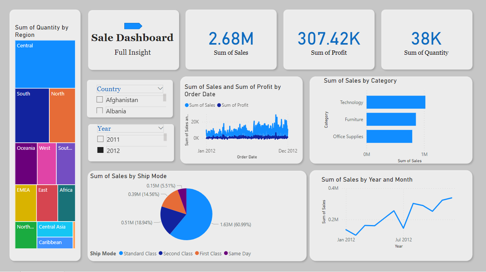

# Sales Dashboard 




## What it shows

- **KPI cards:** Sum of Sales, Sum of Profit, Sum of Quantity
- **Quantity by Region** (treemap)
- **Sales & Profit by Order Date** (dual line chart)
- **Sales by Category** (bar chart)
- **Sales by Ship Mode** (pie chart)
- **Sales by Year and Month** (line chart)
- Sidebar **slicers/filters:** Year, Country, Region, Category, Ship Mode, date range
- Filtered-data table with CSV download

## Data

The original data is embedded inside the compressed data model of the `.pbix`
file and cannot be read directly. The app therefore uses this order of
precedence:

1. **Uploaded CSV** — use the uploader in the sidebar.
2. **`sales.csv`** — if you place a file with this name in this folder, it is
   loaded automatically.
3. **Synthetic sample data** — generated on the fly (calibrated to the
   dashboard's headline totals) so the app runs out of the box.

### CSV format

Expected columns (case-insensitive, common aliases accepted):

`Order Date`, `Region`, `Country`, `Category`, `Sub-Category` (optional),
`Ship Mode`, `Sales`, `Profit`, `Quantity`

To get the exact numbers from the original report, export the table from
Power BI Desktop (or DAX Studio) as `sales.csv` into this folder.


```

The app opens at https://sale-analysis-power-bi-4mz.streamlit.app/
